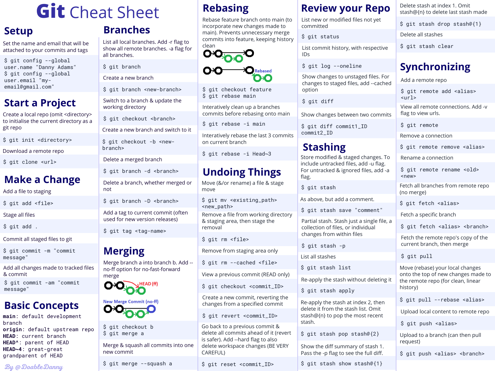

# Git Cheat Sheet

This repository is a collection of syntax, commands about git.  
This cheat sheet contains 50 commonly used git commands.
> 👌 Feel free to use my repository and star it if you find something interesting 😄

 

